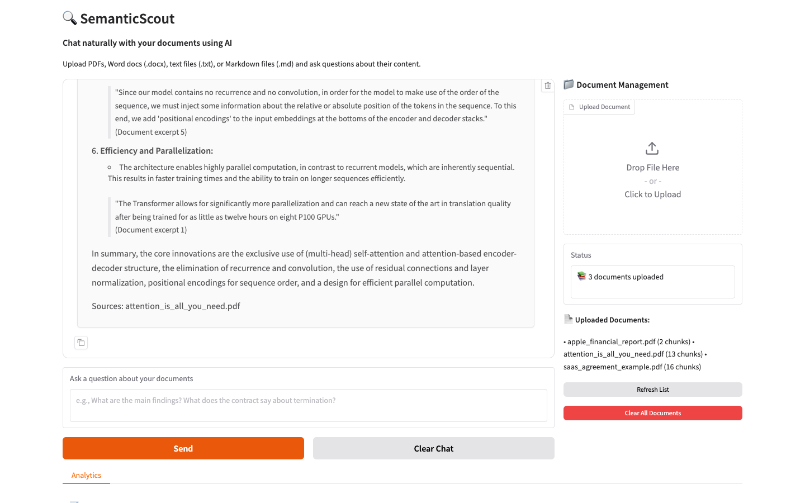

# 🔍 SemanticScout

> **Chat with Your Documents Using GPT-4.1**  
> Transform how you interact with documents through conversational AI and intelligent semantic search

[](https://www.python.org/downloads/)
[](https://platform.openai.com/)
[](https://python.langchain.com/)
[](https://gradio.app/)
[](https://github.com/NeurArk/SemanticScout/actions)



## 🎯 Overview

SemanticScout is a cutting-edge **"Chat with Your Documents"** application that combines the power of GPT-4.1 conversational AI with advanced semantic search. Ask questions naturally and get intelligent, context-aware answers from your document collection. Built with the latest 2025 AI technologies, it features adaptive search intelligence that automatically optimizes for any domain - from technical papers to financial reports.

### ✨ Key Features

- **🧠 Intelligent Processing**: Multi-format document support (PDF, DOCX, TXT, MD)
- **🔍 Semantic Search**: Natural language queries with contextual understanding
- **🎯 Adaptive Intelligence**: Domain-agnostic threshold adaptation for optimal results
- **💬 Chat Interface**: GPT-4.1 powered conversational document exploration
- **📊 Visual Analytics**: Interactive document relationship visualization
- **⚡ Real-time Results**: Sub-2-second search responses with relevance scoring
- **🎨 Professional UI**: Modern Gradio interface with automatic dark/light theme support
- **🛡️ Enterprise Ready**: Secure, scalable architecture with comprehensive testing

## 🚀 Quick Start

### Option 1: Use Hosted Demo
Deploy your own instance on Hugging Face Spaces (see deployment section)

### Option 2: Docker Compose
```bash
docker-compose up --build
```

### Option 3: Manual Setup

### Prerequisites

- **Python 3.11+**
- **OpenAI API Key** ([Get yours here](https://platform.openai.com/api-keys))
- **Git** for version control

### Installation

1. **Clone the repository**:
   ```bash
   git clone https://github.com/NeurArk/SemanticScout.git
   cd SemanticScout
   ```

2. **Create virtual environment**:
   ```bash
   python -m venv venv
   source venv/bin/activate  # On Windows: venv\Scripts\activate
   ```

3. **Install dependencies**:
   ```bash
   pip install -r requirements.txt
   ```

4. **Configure environment**:
   ```bash
   cp .env.example .env
   # Edit .env and add your OpenAI API key
   ```

5. **Initialize the environment**:
   ```bash
   python scripts/setup.py
   ```
6. **Launch the application**:
   ```bash
   python app.py
   ```
7. **Open your browser** to `http://localhost:7860`

## 💡 Usage

### Document Upload
- Drag & drop or click to upload PDF, DOCX, TXT, or MD files
- Maximum file size: 100MB
- Real-time processing with progress indicators

### Chat with Documents
- **Conversational Interface**: Ask questions naturally and get intelligent responses
- **Context-Aware**: Maintains conversation history for follow-up questions
- **Source Attribution**: Every answer includes document sources
- **Enter to Send**: Streamlined UX with keyboard shortcuts

### Semantic Search
- Enter natural language queries like:
  - *"What is attention?"* - Tests adaptive search
  - *"Compare revenue models across documents"* - Multi-document analysis
  - *"Explain the transformer architecture"* - Technical deep dives

### Visual Analytics
- **Document Distribution**: See your document types at a glance
- **Size vs Complexity**: Scatter plot showing document characteristics
- **Theme Adaptive**: Charts automatically adjust to light/dark modes

## 📄 Sample Documents
- **Apple Financial Report** (`apple_financial_report.pdf`) - Q3 2024 quarterly results
- **Attention Is All You Need** (`attention_is_all_you_need.pdf`) - Transformer architecture paper
- **SaaS Agreement Example** (`saas_agreement_example.pdf`) - Enterprise software contract

## ❓ Demo Questions
- **General**: "What is attention?" → Tests adaptive search for short queries
- **Financial**: "What was Apple's revenue in Q3 2024?"
- **Technical**: "Explain the transformer architecture"
- **Legal**: "What are the termination clauses in the SaaS agreement?"
- **Cross-document**: "Compare the complexity between transformers and Apple's financials"

## 🏗️ Architecture

### Core Technologies

| Component | Technology | Version | Purpose |
|-----------|------------|---------|---------|
| **AI Framework** | LangChain + LangGraph | Latest | RAG pipeline orchestration |
| **Language Model** | OpenAI GPT-4.1 | Latest | Chat & query understanding |
| **Embeddings** | text-embedding-3-large | 3072-dim | Semantic vector generation |
| **Vector DB** | ChromaDB | Latest | Efficient similarity search |
| **UI Framework** | Gradio | Latest | Interactive web interface |
| **Visualization** | Plotly + NetworkX | Latest | Document relationship graphs |

### System Architecture

```
┌─────────────────┐    ┌─────────────────┐    ┌─────────────────┐
│   Document      │────│   Processing    │────│   Vector        │
│   Upload        │    │   Pipeline      │    │   Storage       │
│   (Multi-format)│    │   (Extraction)  │    │   (ChromaDB)    │
└─────────────────┘    └─────────────────┘    └─────────────────┘
         │                       │                       │
         ▼                       ▼                       ▼
┌─────────────────┐    ┌─────────────────┐    ┌─────────────────┐
│   Gradio UI     │────│   Search Engine │────│   OpenAI API    │
│   (User Interface)   │   (Semantic)    │    │   (GPT-4.1)     │
└─────────────────┘    └─────────────────┘    └─────────────────┘
```

### 🎯 Adaptive Search Intelligence

SemanticScout employs an advanced **domain-agnostic adaptive search system** that automatically adjusts retrieval parameters based on:

- **Query Complexity Analysis**: Linguistic patterns determine optimal search thresholds
- **Corpus Vocabulary Extraction**: Dynamic analysis of document collection characteristics  
- **Auto-calibration**: Real-time adjustment based on result distribution
- **Query Expansion**: Automatic enhancement of short queries for better recall

This ensures optimal results whether searching technical papers, financial reports, or legal documents without manual configuration.

## 📊 Performance

- **Processing Speed**: < 30 seconds per document
- **Chat Response**: < 3 seconds for contextual answers
- **Search Accuracy**: Adaptive thresholds ensure optimal recall/precision balance
- **Scalability**: Tested with technical papers, financial reports, and legal documents
- **Resource Efficient**: ~$0.15 per chat query with GPT-4.1
- **Test Coverage**: 82% with comprehensive unit and integration tests

## 🛠️ Development

### Project Structure

```
SemanticScout/
├── app.py                 # Main Gradio application
├── core/                  # Core business logic
│   ├── models/           # Data models
│   ├── document_processor.py  # Document processing
│   ├── embedder.py       # Embedding generation
│   ├── rag_pipeline.py   # RAG orchestration
│   ├── chat_engine.py    # Chat functionality
│   ├── vector_store.py   # Vector storage
│   └── utils/            # Utilities including adaptive search
├── config/               # Configuration
├── tests/                # Test suites (82% coverage)
├── samples/              # Example documents
├── images/               # UI screenshots
└── requirements.txt      # Dependencies
```

### Running Tests

```bash
# Run all tests
pytest

# Run with coverage (82% achieved!)
pytest --cov=core

# Run specific test category
pytest tests/unit/
pytest tests/integration/
```

### Code Quality

```bash
# Format code
black . --line-length 100

# Run linting
ruff check .

# Type checking (if configured)
mypy core/

# Run all tests with coverage
pytest --cov=core --cov-report=html
```

## 🚀 Deployment

### Local Demo
Perfect for client presentations and development:
```bash
python app.py --host 0.0.0.0 --port 7860
```

### Hugging Face Spaces
Free hosting for demos:
1. Fork this repository
2. Create a new Space on Hugging Face
3. Connect your GitHub repository
4. Add your OpenAI API key to Space secrets

### Docker Production
```bash
docker build -t semantic-scout .
docker run -p 7860:7860 -e OPENAI_API_KEY=your_key semantic-scout
```

## 📈 Use Cases

### 🏢 Enterprise Applications
- **Document Discovery**: Find relevant documents across large repositories
- **Knowledge Management**: Organize and search company knowledge bases
- **Research Assistance**: Accelerate literature reviews and research
- **Compliance**: Locate policy documents and regulatory information

### 🎯 Demo Scenarios
- **Client Presentations**: Showcase AI capabilities with real documents
- **Technical Interviews**: Demonstrate semantic search understanding
- **Portfolio Projects**: Highlight modern AI/ML development skills
- **Proof of Concepts**: Validate semantic search for specific domains

## 🆘 Backup Plan
If something fails during the demo, restart the application and check logs in the `logs/` directory or run `docker-compose up` again.

## 📚 Key Technologies Explained

### RAG (Retrieval Augmented Generation)
Combines the power of semantic search with GPT-4.1 to provide accurate, contextual answers based on your documents.

### Adaptive Search
Our proprietary algorithm automatically adjusts search parameters based on query complexity and document characteristics, ensuring optimal results without manual tuning.

### ChromaDB Integration
Efficient vector storage with cosine similarity search, optimized for semantic retrieval at scale.

## 🤝 Contributing

We welcome contributions! Please see our development guidelines:

1. **Fork** the repository
2. **Create** a feature branch (`git checkout -b feature/amazing-feature`)
3. **Commit** your changes (`git commit -m 'Add amazing feature'`)
4. **Push** to the branch (`git push origin feature/amazing-feature`)
5. **Open** a Pull Request

### Development Guidelines
- Follow the existing code style and patterns
- Add tests for new features
- Update documentation for significant changes
- Ensure all CI checks pass

## 📄 License

This project is licensed under the MIT License - see the [LICENSE](LICENSE) file for details.

## 🎯 Professional Portfolio

**SemanticScout** showcases advanced AI/ML capabilities including:
- **RAG (Retrieval Augmented Generation)** implementation
- **Vector database** integration and optimization
- **Modern LLM** application development
- **Production-ready** software architecture
- **Enterprise-grade** user experience design

Perfect for demonstrating expertise in:
- 🤖 **AI/ML Engineering**
- 🔧 **Python Development**
- 🏗️ **System Architecture**
- 🎨 **UI/UX Design**
- 📊 **Data Visualization**

## 🔗 Links

- **Live Demo**: [Coming Soon on Hugging Face]
- **GitHub**: [https://github.com/NeurArk/SemanticScout](https://github.com/NeurArk/SemanticScout)
- **Portfolio**: [NeurArk](https://github.com/NeurArk)
- **Issues & Support**: [GitHub Issues](https://github.com/NeurArk/SemanticScout/issues)

---

**Built with ❤️ by [NeurArk](https://www.neurark.com) • Powered by OpenAI GPT-4.1 & LangChain**

*Transform your document search experience with the power of semantic AI.*